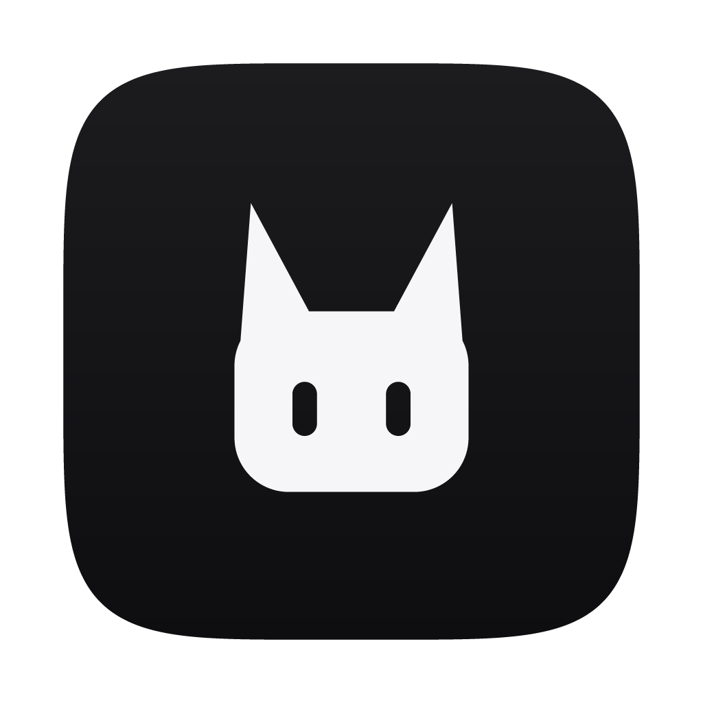
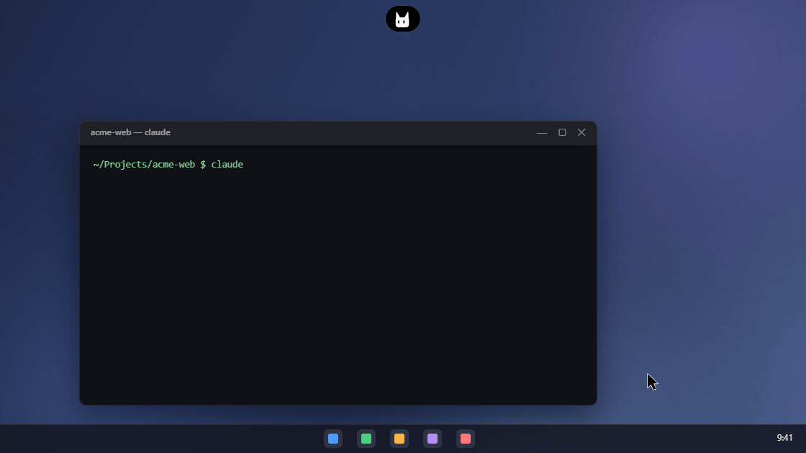

<p align="center">
  
</p>

<h1 align="center">Kumo</h1>

<p align="center">
  A small companion that lives at the top of your screen and keeps an eye on your coding agents,<br>
  so you can stop checking terminals and keep coding.
</p>

<p align="center">
  <a href="https://github.com/liwidale/kumo/releases/latest"></a>
  
  <a href="LICENSE"></a>
</p>

<p align="center">
  
</p>

<p align="center"><sub>Recorded from the real app. Everything in the island is Kumo itself reacting to real agent events.</sub></p>

Running Claude Code in one window, Copilot CLI in another and Cursor somewhere else? Kumo puts all of them in one place. It shows what every agent is doing, lets you approve their requests from wherever you are, and tells you when one of them is done or needs you.

## Contents

- [Download](#download)
- [What you get](#what-you-get)
- [Supported agents](#supported-agents)
- [Getting started](#getting-started)
- [Everyday use](#everyday-use)
- [Keyboard shortcuts](#keyboard-shortcuts)
- [Questions from agents (MCP)](#questions-from-agents-mcp)
- [Connecting an agent by hand](#connecting-an-agent-by-hand)
- [Privacy](#privacy)
- [Where Kumo keeps its files](#where-kumo-keeps-its-files)
- [Troubleshooting](#troubleshooting)
- [Building from source](#building-from-source)
- [How it works](#how-it-works)
- [Project structure](#project-structure)
- [Contributing](#contributing)
- [License](#license)

## Download

**[Get the latest version](https://github.com/liwidale/kumo/releases/latest)**

| | File | Works on |
| --- | --- | --- |
| macOS | `Kumo-<version>-mac.dmg` | macOS 12 or later, Apple silicon and Intel |
| Windows | `Kumo-Setup-<version>.exe` | Windows 10 and 11, 64-bit |

Kumo is free and open source. It updates itself: on Windows a new version installs with one click, on macOS Kumo tells you about it and opens the download page.

## What you get

- **Every session at a glance.** Hover the island to see each agent's project, what it is doing right now, a live diff of the file it is editing, its plan and how full its context is.
- **Approve from anywhere.** When an agent wants to run a command or edit a file, the request appears on top of whatever you are doing. Allow it, deny it, allow it for the rest of the session or turn your answer into a rule. Risky commands like `rm -rf` or `git push --force` are flagged.
- **Questions with answer buttons.** Kumo is also an MCP server. Agents can ask you something with a few one-click answers right in the island, or leave you a short note when a long task is done.
- **Start a task from anywhere.** Press the quick launch shortcut, type what you want, pick a project and an agent, and press Enter.
- **Hand over context in one drop.** Drag files, folders, screenshots or a whole window onto Kumo, and they go to the agent you choose on its next turn.
- **Talk back.** Answer an agent's question, queue your next message for when it finishes, or stop it.
- **Review and undo.** See what changed with syntax highlighting and line numbers, and restore any single file.
- **Know your limits.** Your five-hour and weekly plan limits for Claude Code and Codex, plus cost and tokens per session.
- **Your day in review.** Sessions, finished tasks, changed files and every approval you made.
- **Chat about your work.** Ask questions about a session using Claude Code, Anthropic, OpenAI, Google, OpenRouter, Mistral, DeepSeek, Groq, xAI, Together, Ollama, LM Studio or any OpenAI-compatible service.
- **Speaks your language.** English, Русский, Deutsch, Français, Español, Português, 日本語 and 简体中文.
- **Stays out of the way.** On a MacBook Kumo sits around the notch; on other screens it floats at the top edge. When nothing is happening you only see the little character, and you can hide it in the tray entirely. It also steps aside when a full-screen app is in front.

## Supported agents

| Agent | Sessions | Approvals | Context | Plan limits | Questions (MCP) |
| --- | :---: | :---: | :---: | :---: | :---: |
| Claude Code (terminal and Claude Desktop) | ✓ | ✓ | ✓ | ✓ | ✓ |
| Antigravity (desktop and CLI) | ✓ | ✓ | ✓ | | |
| Codex | ✓ | ✓ | ✓ | ✓ | ✓ |
| Gemini CLI | ✓ | optional | ✓ | | ✓ |
| Cursor | ✓ | optional | | | ✓ |
| GitHub Copilot CLI | ✓ | ✓ | | | ✓ |
| Qwen Code | ✓ | ✓ | ✓ | | ✓ |
| Windsurf | ✓ | optional | | | ✓ |
| OpenCode | ✓ | optional | ✓ | | ✓ |
| Kiro CLI (beta) | ✓ | optional | ✓ | | ✓ |
| Amp (beta) | ✓ | optional | | | ✓ |
| Cline (beta) | ✓ | optional | | | ✓ |
| Aider | alerts | | | | |
| Roo Code | | | | | ✓ |

**Optional** means the agent already asks for permission on its own, and you can choose in **Settings → Agents** whether those requests come to Kumo instead. Any other tool that can run a command on its events can report to Kumo too, see [Connecting an agent by hand](#connecting-an-agent-by-hand).

## Getting started

1. **Install Kumo.** Open the downloaded file and follow the usual steps.
2. **Open it the first time.** Kumo isn't signed by Apple or Microsoft yet, so your system asks once:
   - **macOS:** right-click Kumo in Applications and choose **Open**. If macOS still refuses, run `xattr -dr com.apple.quarantine /Applications/Kumo.app` in Terminal.
   - **Windows:** if SmartScreen appears, click **More info**, then **Run anyway**.
3. **Connect your agents.** On first launch Kumo lists the agents it found on your computer and connects the ones you tick with one click. You can also do it later in **Settings → Agents**, where Kumo shows exactly what it will add to each agent's settings. A backup is always saved and everything else stays untouched.
4. **Work as usual.** Start a session in your agent. Kumo picks it up straight away. Sessions that were already running show up from their next step.

## Everyday use

- **Glance:** the island shows the busiest session, a spinner while agents work and a count when several run at once.
- **Hover:** a short preview opens with the current step, a live diff and the other sessions.
- **Click:** the full view with every session, its activity, the files it touched and the git changes in that project. **Sessions**, **Chat** and **Context** tabs sit at the top.
- **Approve:** requests open by themselves. Answer with the buttons, or with the global shortcuts without leaving your editor. If you don't answer in time, the agent asks in its own window as usual.
- **Rules:** choose **Always allow** or **Always deny** on a request, or write rules in **Settings → Approvals**. Use `*` as a wildcard, for example `npm test*`. Deny rules always win.
- **New session:** the **+** button or the quick launch shortcut starts an agent in a project. Agents that take a task on the command line get it directly; for the others the task is copied to the clipboard.
- **Tray:** pause notifications, switch to tray only, open settings or quit.

## Keyboard shortcuts

| Action | macOS | Windows |
| --- | --- | --- |
| Open or close Kumo | `⌘⌥K` | `Ctrl+Alt+K` |
| Quick launch a task | `⌘⇧Space` | `Ctrl+Alt+Space` |
| Allow the current request | `⌘⌥Y` | `Ctrl+Alt+Y` |
| Deny the current request | `⌘⌥N` | `Ctrl+Alt+N` |
| New session (island open) | `⌘N` | `Ctrl+N` |
| Switch tabs (island open) | `⌘1` `⌘2` `⌘3` | `Ctrl+1` `Ctrl+2` `Ctrl+3` |

In the quick launch bar: `Enter` starts, `Tab` switches the agent, `↑` `↓` switch the project and `Esc` closes. You can change both global shortcuts and the language in **Settings → General**.

## Questions from agents (MCP)

Kumo can register itself as an MCP server in your agents. They then get two tools:

- `ask_user` shows a question in the island with up to four one-click answers and an optional text field, and waits for your answer.
- `notify_user` shows a short note, for example when a long task is finished.

Turn it on in **Settings → Agents → Questions from agents**, or tick the box in the first-run wizard. Kumo can set it up for Claude Code, Codex, Gemini CLI, Qwen Code, Cursor, Windsurf, Copilot CLI, Kiro CLI, OpenCode, Amp, Roo Code and Cline. Restart the agent afterwards.

For any other MCP client, add a stdio server that runs the relay with `--mcp`:

```json
{
  "mcpServers": {
    "kumo": {
      "command": "~/.kumo/bin/kumo-hook",
      "args": ["--mcp", "--agent", "my-agent"]
    }
  }
}
```

On Windows the command is `%USERPROFILE%\.kumo\bin\kumo-hook.exe`. Use the full path, since most clients don't expand `~`.

## Connecting an agent by hand

Kumo listens for events through a tiny relay program, `kumo-hook`, that it installs in `~/.kumo/bin`. Any tool that can run a command on its events can use it. The relay reads the event as JSON on stdin, passes it to Kumo and prints Kumo's answer. If Kumo isn't running, it answers neutrally right away, so your tool keeps working.

```bash
~/.kumo/bin/kumo-hook --agent my-agent SessionStart
~/.kumo/bin/kumo-hook --agent my-agent PreToolUse
~/.kumo/bin/kumo-hook --agent my-agent Stop
```

**Settings → Agents → Other agents** shows the exact command for your computer. Events use the Claude Code hook format; sessions from your tool get their own row, approvals and context hand-off.

## Privacy

- Everything stays on your computer. There is no account, no telemetry and no cloud.
- Kumo only contacts the chat provider you pick, and only when you send a message. The update check asks GitHub for the latest release and can be turned off in **Settings → About**.
- API keys are kept in the macOS Keychain or protected by Windows.
- The title of the window you came from is read only when you open Kumo, and only if **Notice the window you came from** is on.
- You can erase chats, history and saved context at any time in **Settings → Privacy**.

## Where Kumo keeps its files

| What | macOS | Windows |
| --- | --- | --- |
| Settings, history, chats, logs | `~/Library/Application Support/Kumo` | `%APPDATA%\Kumo` |
| Relay and connection info | `~/.kumo` | `%USERPROFILE%\.kumo` |
| Backups of agent settings | next to each file, as `*.kumo-backup-<date>` | same |

**Settings → Privacy → Data folder → Show** opens the first folder.

## Troubleshooting

**An agent doesn't show up.**
Open **Settings → Agents** and check that it says **Connected**. If it says **Needs reconnect**, click **Reconnect**: this happens after Kumo was moved or reinstalled. Then start a new session in the agent; some agents only read their settings at startup.

**"Kumo can't receive events from your agents".**
Another program may be using Kumo's local port. Quit Kumo from the tray and open it again; it picks a free port and tells the relay where to find it.

**The settings file "needs a look".**
Kumo never overwrites a settings file it can't read. Fix the JSON in that file (the path is shown on the card) and click **Connect** again.

**The island is gone.**
It hides while a full-screen app is in front, and in tray only mode it appears only when something needs you. Press the open shortcut or click the tray icon.

**macOS doesn't bring the right terminal tab forward.**
Allow Kumo under **System Settings → Privacy & Security → Automation** the first time macOS asks.

**Something else.**
Logs are in the `logs` folder inside the data folder. Please attach the latest one when you [open an issue](https://github.com/liwidale/kumo/issues).

## Building from source

### Requirements

- [Git](https://git-scm.com/)
- [Node.js](https://nodejs.org/) 24 or later, with npm
- [Rust](https://rustup.rs/) stable, for the relay
- **Windows:** the Visual Studio Build Tools with the "Desktop development with C++" workload, which Rust needs to link
- **macOS:** the Xcode command line tools (`xcode-select --install`)

### Run it

```bash
git clone https://github.com/liwidale/kumo.git
cd kumo
npm ci
npm run relay
npm start
```

`npm run relay` builds `kumo-hook` and stages it in `resources/relay`. `npm start` builds the app and opens it. If an installed copy of Kumo is running, quit it first: only one instance runs at a time.

### Useful scripts

| Command | What it does |
| --- | --- |
| `npm start` | Build and run |
| `npm run dev` | Build with source maps and run |
| `npm run build` | Build into `out/` without running |
| `npm run typecheck` | Check the TypeScript |
| `npm run relay` | Build the relay for this computer |
| `npm run pack:win` | Build the Windows installer into `release/` |
| `npm run pack:mac` | Build the universal macOS DMG and ZIP into `release/` |
| `npm run icons` | Regenerate app and tray icons |

### Releases

Pushing a tag like `v1.2.0` runs the release workflow in `.github/workflows/release.yml`. It builds both platforms on GitHub Actions and publishes a release with the installers and the update files Kumo uses to update itself. Signing and notarization turn on automatically when the matching secrets are set.

## How it works

```
agent ──hook──▶ kumo-hook ──HTTP (localhost, token)──▶ Kumo ──▶ island, tray, notifications
                    ▲                                     │
                    └───────────── answer ◀───────────────┘
```

1. When you connect an agent, Kumo adds hook entries to the agent's own settings. Each entry runs `kumo-hook` with the event name.
2. `kumo-hook` is a small Rust program. It reads the event from stdin, adds a few details such as the working directory and the parent processes, and posts it to Kumo's server on `127.0.0.1`. The port and a random token are in `~/.kumo/runtime.json`.
3. Kumo turns events into sessions, steps, approvals and questions, and the island shows them.
4. For approvals the relay waits for your answer and prints it in the format the agent expects. If Kumo is closed or you don't answer in time, it prints a neutral answer and the agent asks you as usual.
5. Agents with plugin systems instead of hooks (OpenCode, Amp, Cline) get a small generated plugin that talks to the same server. Aider uses its notification command.
6. With `--mcp`, the same relay speaks MCP over stdio and forwards `ask_user` and `notify_user` to Kumo.

## Project structure

```
src/
  main/          Electron main process: hook server, sessions, agent integrations,
                 windows, tray, updater, quick launch
    agents/      one adapter per agent that turns its events into Kumo's
    platform/    macOS and Windows specifics (windows, terminals, notch)
    chat/        chat providers
  preload/       the bridge between the main process and the windows
  renderer/      the island, the settings window and the quick launch bar (React)
  shared/        types and translations used on both sides
relay/           kumo-hook, the relay agents run (Rust)
resources/       icons, tray images, macOS entitlements
scripts/         build, packaging and icon scripts
```

## Contributing

Issues and pull requests are welcome.

- Run `npm run typecheck` and try your change with `npm start` before opening a pull request.
- New user-facing text goes through `tr()`. Add a translation for every language in `src/shared/locales`; the English text is the key.
- To support a new agent, add an adapter in `src/main/agents/adapters.ts` and an integration in `src/main/integrations.ts`. Kumo must always leave the agent's other settings untouched and save a backup first.

## License

[MIT](LICENSE) © 2026 Liwidale
